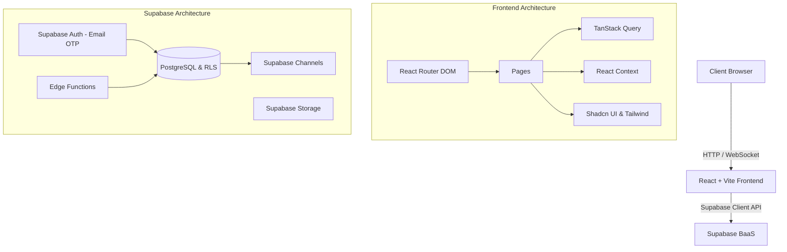
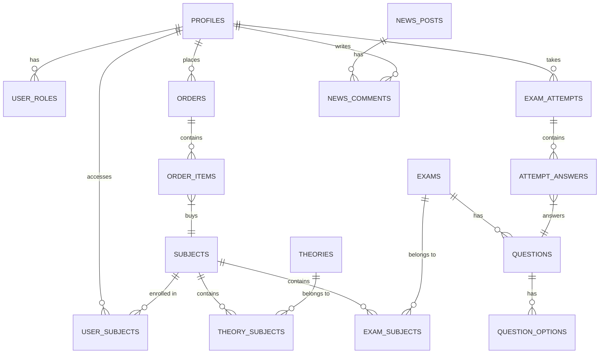

<div align="center">
  
  
  # TQMaster

  **Hệ thống Quản lý Học tập & Ôn thi Trực tuyến**

  <p align="center">
    
    
    
    
    
  </p>
</div>

---

## Tổng quan

**TQMaster** là nền tảng E-Learning được xây dựng nhằm cung cấp giải pháp quản lý khóa học, tài liệu và tổ chức thi trắc nghiệm trực tuyến. Hệ thống tập trung vào hiệu năng (performance), trải nghiệm làm bài thi mượt mà, và quy trình quản trị nội dung linh hoạt.

Dự án được phát triển theo tiêu chuẩn **Spec-Driven Development (SDD)**, đảm bảo tính chặt chẽ từ khâu đặc tả yêu cầu đến triển khai mã nguồn.

---

## Tính năng chính

### Dành cho Học viên (Student Portal)
- **StudyHub & E-commerce**: Duyệt danh mục khóa học, xem chi tiết, tích hợp giỏ hàng và thanh toán.
- **Hệ thống Test Engine**: Làm bài thi trắc nghiệm với giao diện tối ưu (hiệu ứng swipe/carousel), tính giờ tự động, và chấm điểm/đáp án realtime.
- **Bảng tin**: Nhận thông báo hệ thống và tin tức học thuật.
- **Xác thực an toàn**: Đăng nhập bằng Email OTP (Passwordless auth).
- **Phản hồi**: Tính năng báo lỗi (Report) câu hỏi trực tiếp trong quá trình làm bài.

### Dành cho Quản trị viên (Admin Dashboard)
- **Live Dashboard**: Báo cáo thống kê đơn hàng, doanh thu và người dùng (Tích hợp WebSocket để cập nhật realtime).
- **Quản trị Nội dung (CMS)**: Quản lý (CRUD) môn học, đề thi, câu hỏi và tài liệu lý thuyết.
- **Quản lý Đơn hàng & Người dùng**: Duyệt/hủy đơn hàng, kiểm soát truy cập và phân quyền (Role-based access).
- **Truyền thông**: Quản lý banner thông báo và biên tập bản tin.

---

## Tech Stack

**Frontend:**
- Core: React 18, Vite, TypeScript
- UI & Styling: Tailwind CSS, Shadcn UI, Radix UI
- State & Data: React Context, TanStack Query (React Query)
- Routing: React Router v6
- Forms: React Hook Form, Zod

**Backend (BaaS - Supabase):**
- Database: PostgreSQL (tích hợp Row Level Security - RLS)
- Auth: Supabase Auth (OTP)
- Real-time: Supabase Channels
- Edge Functions: Deno-based (xử lý logic thanh toán, duyệt đơn)
- Storage: Quản lý tài liệu và hình ảnh

---

## Kiến trúc Hệ thống (Architecture & ERD)

### 1. Luồng dữ liệu (Architecture Diagram)



### 2. Sơ đồ Thực thể (ERD)



### 3. Phân quyền (RBAC)

Bảo mật được thiết lập qua nhiều lớp (Multi-layer Security):
- **UI Level**: Sử dụng `Protected Routes` và React Context để ẩn/hiển thị component dựa trên `app_role`.
- **Database Level**: Ứng dụng **Row Level Security (RLS)** của PostgreSQL. (VD: Admin toàn quyền can thiệp dữ liệu, trong khi User chỉ có thể `SELECT` dữ liệu khóa học đã mua).
- **Server-side Logic**: Dùng Edge Functions xác thực JWT Token cho các tác vụ nhạy cảm.

---

## SDD (Spec-Driven Development)

Dự án áp dụng quy trình **Spec-Driven Development**. Mọi tính năng đều bắt buộc phải có tài liệu đặc tả (Spec) trước khi triển khai code.

Cấu trúc lưu trữ tài liệu đặc tả:
```bash
📂 .sdd/specs/
 ├── 01-core-auth/
 ├── 02-admin-dashboard/
 ├── 03-admin-subject-theory/
 ├── 04-admin-exam-questions/
 ├── 05-admin-order-users/
 ├── 06-admin-news/
 ├── 07-user-studyhub/
 ├── 08-user-exam-system/
 ├── 09-user-ecommerce/
 └── 10-user-news/
```
Quy trình này giúp codebase thống nhất, dễ theo dõi tiến độ và đặc biệt phù hợp khi kết hợp với AI Agents trong việc scale hệ thống.

---

## Hướng dẫn cài đặt

### Yêu cầu môi trường
- Node.js (v18+)
- Bun (hoặc npm)
- Supabase Project (cần URL và Anon Key)

### Cài đặt và chạy nội bộ

1. **Clone repository**
   ```bash
   git clone https://github.com/thanhtuanfptse05/smart-curate-learn.git
   cd smart-curate-learn
   ```

2. **Cài đặt dependencies**
   ```bash
   bun install
   ```

3. **Cấu hình biến môi trường**
   Tạo file `.env` tại thư mục gốc:
   ```env
   VITE_SUPABASE_URL=your-supabase-project-url
   VITE_SUPABASE_ANON_KEY=your-supabase-anon-key
   ```

4. **Khởi chạy ứng dụng**
   ```bash
   bun run dev
   ```
   Ứng dụng sẽ khả dụng tại `http://localhost:8080`.
