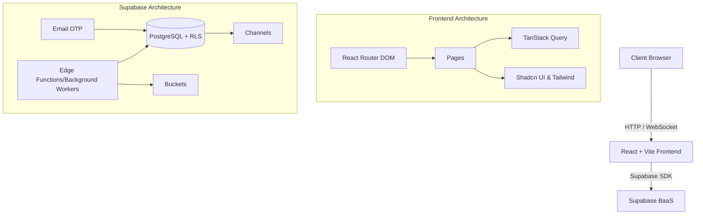
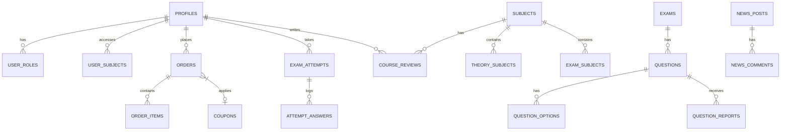

<div align="center">
  
  
  # TQMaster LMS

  **Hệ thống Quản lý Học tập, Thương mại điện tử Khóa học & Đánh giá Năng lực Toàn diện**

  <p align="center">
    
    
    
    
    
  </p>
</div>

---

## 📖 Tổng quan Hệ thống

**TQMaster** là một nền tảng Learning Management System (LMS) hoàn chỉnh được phát triển trên kiến trúc hiện đại, kết hợp giữa mô hình E-commerce bán khóa học và hệ thống Test Engine chuyên sâu. Dự án được triển khai tuân thủ nghiêm ngặt **Spec-Driven Development (SDD)**, sở hữu hệ sinh thái quản trị đồ sộ từ quản lý nội dung, đơn hàng, cho tới xử lý import/export dữ liệu lớn (Bulk processing).

---

## ⚡ Phân hệ Tính năng (Core Modules)

Hệ thống được chia làm 5 phân hệ chính với các chức năng thực tế bám sát nghiệp vụ E-Learning:

### 1. Hệ thống Thương mại & Khóa học (E-Commerce & StudyHub)
- **Danh mục Khóa học**: Phân loại theo chuyên ngành (FPT, VNU, UI/UX, v.v.).
- **Giỏ hàng & Thanh toán (Cart & Orders)**: Luồng thanh toán hoàn chỉnh. Hỗ trợ hệ thống mã giảm giá (**Coupons**).
- **Đánh giá Khóa học (Reviews)**: Học viên có thể để lại Review/Rating sau khi mua khóa học.
- **Tài liệu Lý thuyết (Theory)**: Tích hợp tài liệu lý thuyết (PE Materials) kèm khóa học.

### 2. Test Engine & Đánh giá năng lực (Exam System)
- **Giao diện làm bài**: Hỗ trợ hiệu ứng vuốt (Swipe/Carousel), đồng hồ tính giờ (Timer), và điều hướng câu hỏi linh hoạt.
- **Chấm điểm & Thống kê**: Tự động chấm điểm (Auto-scoring), theo dõi lịch sử làm bài (Exam Stats) và phân tích phổ điểm.
- **Báo lỗi (Question Reports)**: Cho phép học viên báo cáo (report) trực tiếp câu hỏi sai sót trong quá trình thi.
- **Bulk Import/Export**: Nhập/xuất Ngân hàng câu hỏi từ file **Word**, **Excel**, và **ZIP** (có chứa hình ảnh minh họa).

### 3. Phân hệ Tin tức & Giao tiếp (Communication)
- **News/Blog Module**: Đăng tải bài viết tin tức, hỗ trợ phân loại bằng thẻ (Tags) và hệ thống bình luận (Comments) của học viên.
- **Global Announcements**: Quản lý banner thông báo nổi bật (Popup/Banner) xuất hiện toàn hệ thống.

### 4. Quản trị Hệ thống (System Admin Dashboard)
- **Live Analytics Dashboard**: Bảng điều khiển theo dõi doanh thu, số lượng đơn hàng, người dùng (Tích hợp WebSocket báo đơn realtime).
- **Phân quyền & Users**: Quản lý tài khoản (Users), gán quyền (Role-based access control - RBAC).
- **Cấu hình Hệ thống (Settings)**: Quản lý linh hoạt các thông số giao diện và liên kết mạng xã hội (Facebook, v.v.) trực tiếp từ UI.
- **Sao lưu & Phục hồi (Backup/Restore)**: Hệ thống Background Worker xử lý nén (ZIP) và trích xuất dữ liệu toàn bộ DB ra Excel an toàn.

---

## 🛠️ Công nghệ (Tech Stack)

Hệ thống sử dụng kiến trúc **BaaS (Backend-as-a-Service)** với **Supabase** kết hợp Frontend SPA:

**Frontend Ecosystem:**
- **Core**: React 18, Vite, TypeScript.
- **UI & Styling**: Tailwind CSS, Shadcn UI, Radix UI, Lucide Icons.
- **State Management**: TanStack Query (React Query) cho server state, React Context cho global app state.
- **Forms & Data Validation**: React Hook Form kết hợp Zod.

**Backend & Cloud (Supabase):**
- **Database**: PostgreSQL tích hợp **Row Level Security (RLS)** bảo mật tới từng bản ghi.
- **Authentication**: Passwordless Auth thông qua Email OTP.
- **Real-time**: Supabase Channels / WebSockets.
- **Serverless Compute**: Deno Edge Functions xử lý logic nặng (Duyệt đơn, Generate Backup).
- **Storage**: Supabase Storage Buckets (File, Hình ảnh câu hỏi, Avatars).

---

## 🏗️ Kiến trúc Dữ liệu & ERD

### 1. Luồng dữ liệu (Architecture)


### 2. Sơ đồ Thực thể (Core ERD)


---

## 📋 Spec-Driven Development (SDD)

Dự án này là một phiên bản mẫu mực của phương pháp **Spec-Driven Development**. Tất cả các tính năng lớn nhỏ, cấu trúc dữ liệu, và API đều được tài liệu hóa (specs, plans, tasks) TRƯỚC KHI code.

Cấu trúc lưu trữ specs định hình toàn bộ tính năng:
```bash
📂 .sdd/specs/
 ├── 01-core-auth/             # Xác thực OTP, User Profile
 ├── 02-admin-dashboard/       # Thống kê, Settings, Backup
 ├── 03-admin-subject-theory/  # Môn học, Lý thuyết, Reviews
 ├── 04-admin-exam-questions/  # Import Word/Excel/Zip, Reports
 ├── 05-admin-order-users/     # Quản lý Users, Đơn hàng, Coupons
 ├── 06-admin-news/            # Quản lý Thông báo, Tin tức
 ├── 07-user-studyhub/         # Landing, Khám phá môn học
 ├── 08-user-exam-system/      # Carousel Exam, Auto-scoring
 ├── 09-user-ecommerce/        # Giỏ hàng, Áp mã giảm giá
 └── 10-user-news/             # Đọc tin, Bình luận
```

---

## 🚀 Hướng dẫn Cài đặt & Chạy dự án

### Yêu cầu
- Node.js (v18+)
- Bun (hoặc npm)
- Supabase Project (cần URL và Anon Key)

### Các bước thiết lập

1. **Clone repository**
   ```bash
   git clone https://github.com/thanhtuanfptse05/smart-curate-learn.git
   cd smart-curate-learn
   ```

2. **Cài đặt dependencies**
   ```bash
   bun install
   ```

3. **Cấu hình biến môi trường**
   Tạo file `.env` tại thư mục gốc:
   ```env
   VITE_SUPABASE_URL=your-supabase-project-url
   VITE_SUPABASE_ANON_KEY=your-supabase-anon-key
   ```

4. **Khởi chạy Development Server**
   ```bash
   bun run dev
   ```
   Hệ thống sẽ chạy tại `http://localhost:8080`.
